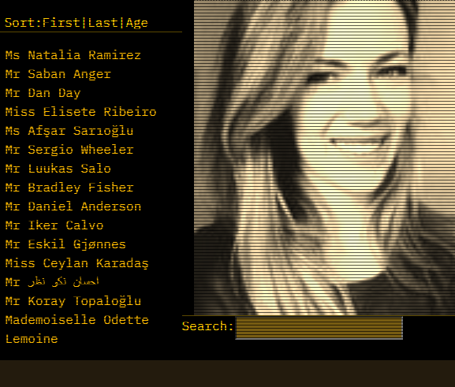

# Homework 11, Burgertime!
[](https://creativecommons.org/licenses/by/4.0/)
## Description
This is a employee directory app that lets users get information on fictionla employees. It was created to demonstrate my comfort and fluency with REACT. All data is loaded via randomuser.me's API, at which point the user can soert the employees by first name, by laste name, or by age. The user can also search for an employee with the search bar, which will dynamically update the employee list as the user types. Clicking on a user will display their profile pic, as well as any public data about them.

This app is fully responsive, and was designed with a "mobile-first" approach. It also has sufficient aesthetic.
## Table of Contents
* [Description](#description)
* [Live URL](#Live%20URL)
* [Testing Instructions](#Testing%20Instructions)
* [Contribution Instructions](#How%20to%20Contribute)
* [Exciting Trivia](#Exciting%20Trivia)
* [Screenshot](#Screenshot)
* [License](#License)
* [Questions](#Questions)
## Installation Instructions
In the same directory as package.json, type ```npm install```
## Live URL
https://still-garden-84796.herokuapp.com/ 
## How to Contribute
No contributions are being accepted at this time.
## Exciting Trivia
The background graphic for this page was inspired by my TA for this course, who very kindly walked me through the logic / flow of it all this morning, when I was entirely at sea. Thank you, Paul!
## Screenshot

## License
License: CC BY 4.0
## Questions
Please contact github@sixbynine.com.
Other projects I've worked on are here: https://github.com/B-Dionysus.